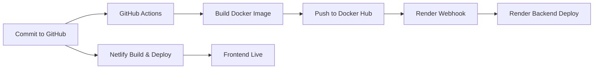

# 🎓 MERN Student Attendance Management System

## 📌 Overview

A **Full-Stack Student Attendance Management System** built with the **MERN stack**.  
It enables teachers to manage students, track attendance, and enforce **role-based access control** with a modern, responsive UI.

---
## 🧑‍💻 Demo Credentials

Use the following credentials to explore the application:

### 👩‍🏫 Teacher Login
- **ID:** `t001`  
- **Password:** `abc@123`

### 🎓 Student Login
- **ID:** `std_1`  
- **Password:** `linus@123`

⚠️ *These demo accounts are provided only for testing purposes.*

## ⚡ Technical Highlights

- Built with **MERN Stack** (MongoDB, Express.js, React, Node.js)  
- Secured with **bcrypt** for password hashing & **JWT** for authentication  
- Input validation handled using **express-validator**  
- Styled with **Tailwind CSS** for responsive and modern UI design  
- Version controlled with **Git & GitHub** for collaboration and source management 

---
## 🚀 Deployment Workflow

This project follows a **professional-grade CI/CD pipeline**:

🔄 **Flow**

- Commit pushed → GitHub Actions runs  
- **Backend**: Docker image built → pushed to Docker Hub → Render auto-deploys via webhook  
- **Frontend**: Netlify auto-builds & deploys React app  

---

🔒 **Environment Variables**

Both **frontend (Netlify)** and **backend (Render)** use environment variables for sensitive data (MongoDB URI, JWT secrets, API keys).  
➡️ No secrets are exposed in the codebase.  

---

🛠️ **Tech Stack**

- **Frontend**: React, Tailwind CSS, React Router DOM  
- **Backend**: Node.js, Express.js  
- **Database**: MongoDB + Mongoose  
- **Authentication**: JWT, bcrypt  
- **Validation & Security**: express-validator, sanitization  
- **Deployment**: GitHub Actions, Docker, Docker Hub, Render, Netlify  

---

✨ **Features**

👩‍🏫 **Teacher**  
- Add / delete students  
- Mark and update attendance  
- View student records in a dynamic table  

🎓 **Student**  
- Secure login  
- View personal attendance records  
- Track attendance percentage    

  
- Built **Teacher component** to display students’ attendance in a table format.  
- Faced a challenge: dates were stored in an array, attendance as `{date: status}`.  
- Solved it by mapping dates and matching keys.  
- Designed a scrollable table with fixed student info + scrollable attendance.  

🚀 **Final Thoughts**  

This project evolved from a simple CRUD app into a secure, scalable, production-ready MERN application.  

It demonstrates:  
- Building & securing full-stack apps  
- Real-world CI/CD with Docker + GitHub Actions + Render + Netlify  
- Strong focus on security, scalability, and clean UI/UX  

📌 This project showcases both my technical expertise (**MERN stack, DevOps, security**) and my ability to deliver a **professional-grade deployment pipeline**.  

